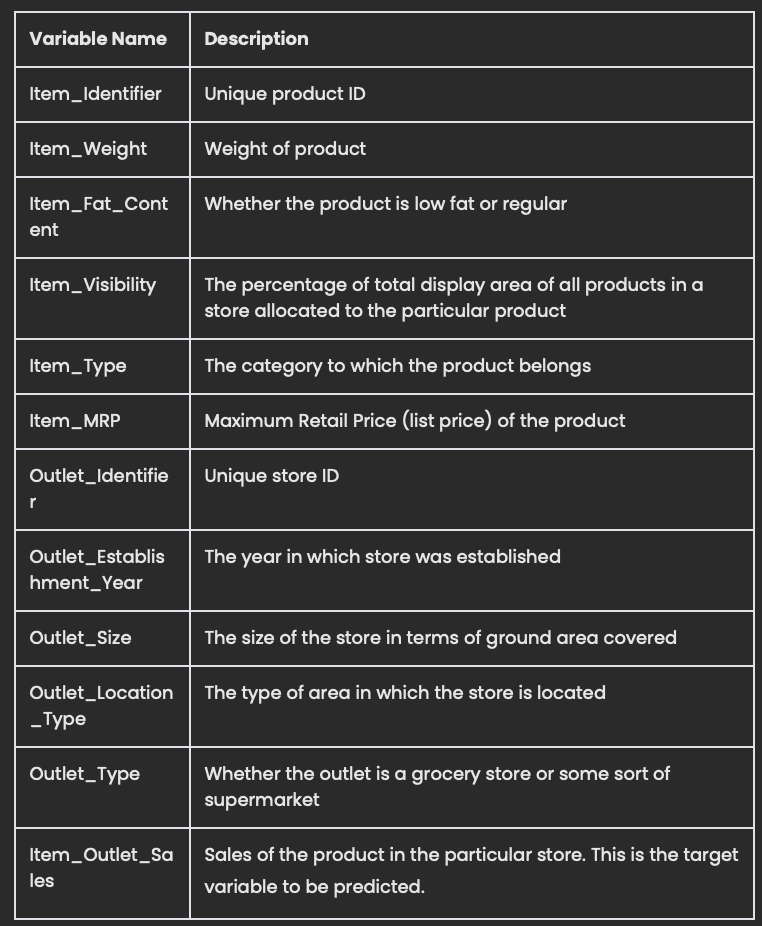

# Project 1 - Revisited 
# Outlet-Store-Sales

## Data Dictionary -

## LinearRegression coefficients plot - each Outlet_Location_Type from Type 1 to Type 3 basically tells us that the most impactful features are based on location of the outlet stores.

## RandomForrestRegressor feature importances plot - the 5 features below had the most impact on the model

## SHAP Summary bar plot
### When compared to feature importances plot image above, they are very similiar except for Item_Visibility and Outlet_Type_Supermarket Type 3 were in reverse order.

## SHAP Summary dot plot
### - Item_MRP: the higher the value the more of a positive impact it had on the prediction
### - Outlet_Type_Grocery Store: higher values had a negative impact
### - Outlet_Type_Supermarket Type3: higher values had a positive impact

## Individual Force Plot 
### Item_MRP and Outlet_Type_Supermarket Type3 had the most impact
- Item_MRP has the most negative influence from base value of 2.212
- Outlet_Type_Supermarket Type3 had second most influence in a positive direction base value

## LIME tabular plot
### Features most heavily influenced the predictions according to LIME are Outlet_Type_Grocery Store (positive effect), Item_MRP (negative effect) and Outlet_Type_Supermarket Type3 (positive effect). 

